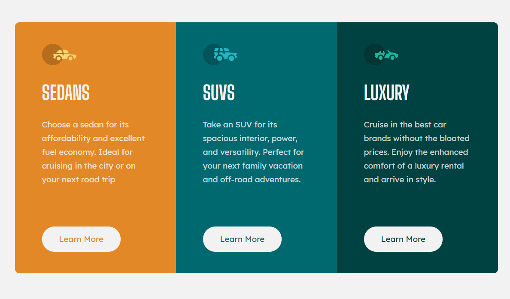
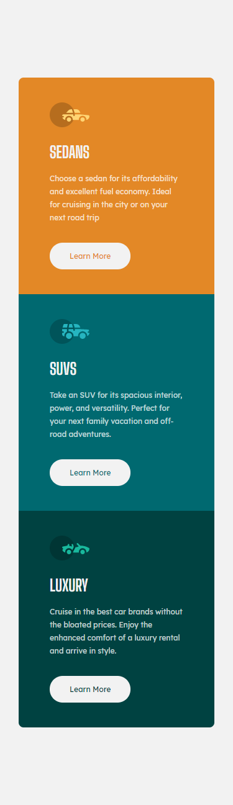

# Frontend Mentor - 3-column preview card component solution

This is a solution to the [3-column preview card component challenge on Frontend Mentor](https://www.frontendmentor.io/challenges/3column-preview-card-component-pH92eAR2-). Frontend Mentor challenges help you improve your coding skills by building realistic projects.

## Table of contents

- [Overview](#overview)
  - [The challenge](#the-challenge)
  - [Screenshot](#screenshot)
  - [Links](#links)
- [My process](#my-process)
  - [Built with](#built-with)
  - [What I learned](#what-i-learned)
- [Author](#author)

## Overview

### The challenge

Users should be able to:

- View the optimal layout depending on their device's screen size

### Screenshot

### Links

- Solution URL: (https://www.frontendmentor.io/solutions/responsive-cards-with-flexbox-and-media-queries-css-vars-UGhgrDQ2E)
- Live Site URL: (https://lm-3col-preview-card.netlify.app/)

## My process

### Built with

- Semantic HTML5 markup
- CSS custom properties/vars
- Flexbox
- Desktop-first workflow

### What I learned

I loved the design on this challenge. Nothing really challenged me, neither did I really learn much from this one, but great for practice! One thing I will say, I adjusted my solution from the design images slightly on the mobile view.

I increased the margin between the card description and button on mobile view, where the cards are stacked. I felt more whitespace gave the design more room to breath and easier to read.

## Author

- Website - [Leon Michalak](https://www.leonmichalak.tech)
- Frontend Mentor - [@NinjaInShade](https://www.frontendmentor.io/profile/NinjaInShade)
- Instagram - [@lmdeveloper](https://www.instagram.com/lmdeveloper/)
