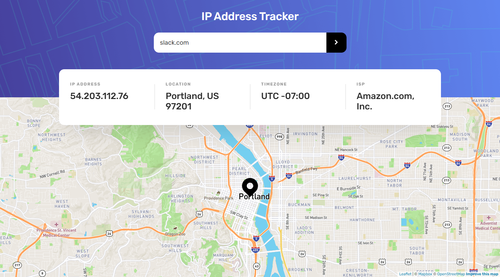
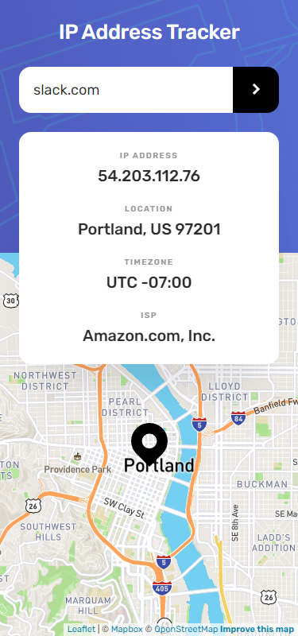

# Frontend Mentor - IP address tracker solution

This is a solution to the [IP address tracker challenge on Frontend Mentor](https://www.frontendmentor.io/challenges/ip-address-tracker-I8-0yYAH0). Frontend Mentor challenges help you improve your coding skills by building realistic projects.

## Table of contents

- [Overview](#overview)
  - [The challenge](#the-challenge)
  - [Screenshot](#screenshot)
  - [Links](#links)
- [My process](#my-process)
  - [Built with](#built-with)
  - [What I learned](#what-i-learned)
- [Author](#author)

## Overview

### The challenge

Users should be able to:

- View the optimal layout for each page depending on their device's screen size
- See hover states for all interactive elements on the page
- See their own IP address on the map on the initial page load
- Search for any IP addresses or domains and see the key information and location

### Screenshot

### Links

- Solution URL: (https://www.frontendmentor.io/solutions/responsive-ip-tracker-using-2-apis-KlGcL9y6-)
- Live Site URL: (https://lm-ip-address-tracker.netlify.app/)

## My process

### Built with

- ipIFY geolocation API
- LeafletJS map API
- Javascript
- Semantic HTML5 markup
- CSS custom properties/vars
- Desktop-first workflow

### What I learned

I learnt how to use the leaflet map API to create and display a map based on a certain location, using their documentation. With ipIFY API, I also used their documentation, however this was a very simple process to get working with a fetch call.

## Author

- Website - [Leon Michalak](https://www.leonmichalak.dev)
- Frontend Mentor - [@NinjaInShade](https://www.frontendmentor.io/profile/NinjaInShade)
- Instagram - [@TheFrontendGuy](https://www.instagram.com/thefrontendguy/)
